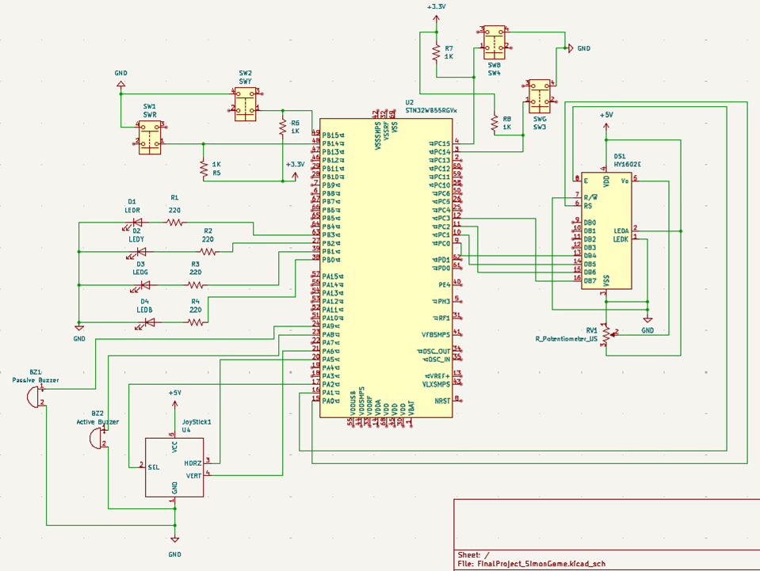

Overview: Simon-style memory game using parts from Elegoo Mega 2560 Kit controlled by the STM32 microcontroller.

Main Features:
    Single-player mode
    Two-player mode
    Buzzer sound feedback
    Score tracking
    LED and pushbutton pairing

System Architecture:
User Inputs > Microcontroller > Visual, Audio, & Display Feedback

System Components (based on Subsystem):
- User Inputs: Joystick Module, 4 Pushbuttons
- Visual Feedback: 4 LEDs (Red, Yellow. Green, Blue)
- Audio Feedback: Active & Passive Buzzer
- Display Feedback: LCD1602 Module

Draft Schematic:
